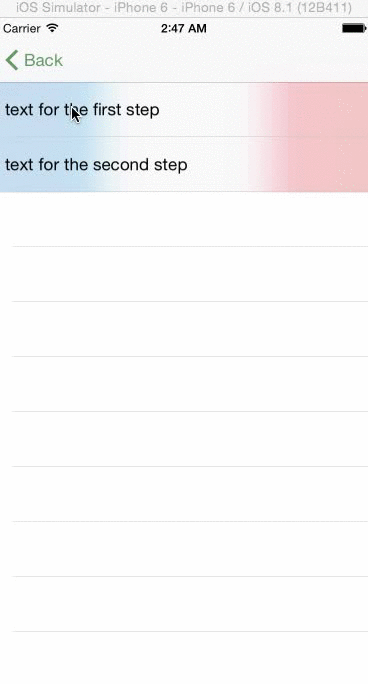

# SwiperView
Swiper View is a class that provides simple and easy-to-use swipable view:

# Description

Swiper View is a UIDynamics-based UIView subclass that provides multiple layers of UIViews with different visual effects.

Swiper View consists of:

1. The view itself
2. Content view to which UIVisualEffects are applied
3. Topmost view (which is a content view) to which readable UI elements should be added
4. UIDynamicsAnimator that handles:
4.1 UICollisionBehavior that restricts movement of the content view
4.2 UIDynamicItemBehavior that restricts rotation of the content view
4.3 UISnapBehavior that attaches center of the content view with base view
5. UIPanGestureRecognizer that reacts on user interaction
6. UILabels for: 
6.1 Left item
6.2 Right item
6.3 Text on topmost item

# Requirements

SwiperView uses [UIVibrancyEffect](https://developer.apple.com/library/prerelease/ios/documentation/UIKit/Reference/UIVibrancyEffect/index.html), which is available only starting **iOS 8.0**.
I personally think that this control doesn't make much of a sense without transparency (blur) and vibrancy (for blur) because user expects "Delete" button to appear, and not a custom control. User won't figure out that there's something underneath cell's view without seeing some kind of indication, for which blur is used.
SwiperView is written in Swift, so you'll need at least **XCode 6.0** to run it

# References

While developing, I've checked out these references:

1. https://github.com/yahoojapan/DynamicsSample
2. https://github.com/TeehanLax/UICollectionView-Spring-Demo/blob/master/UICollectionView-Spring-Demo/TLViewController.m
3. https://developer.apple.com/library/ios/documentation/UIKit/Reference/UISnapBehavior_Class/index.html
4. https://developer.apple.com/library/ios/samplecode/DynamicsCatalog/Introduction/Intro.html

# License

* MIT License is used

# Contributions

If you feel like making a contribution, feel free to create a pull request!
